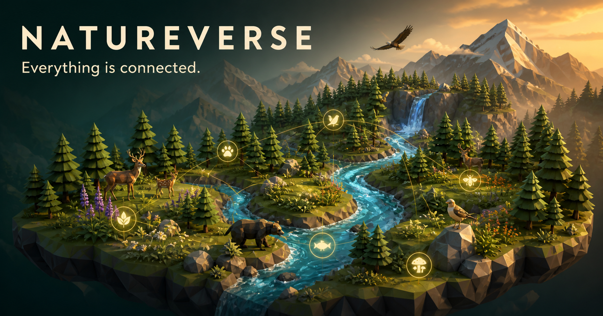
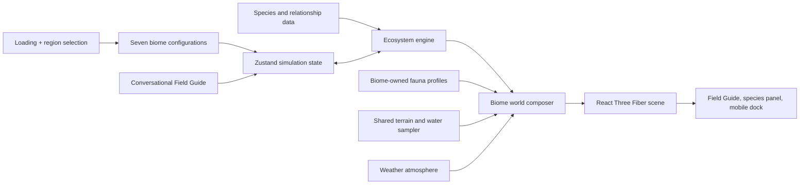

# Natureverse

**Natureverse** is a conversational 3D ecosystem explorer built for Oregon Hacks. Pick one of seven field sites, step into a living scene, then ask a Field Guide what is happening—or describe a weather or habitat change and watch the simulation respond.



## Demo path

1. Watch the Natureverse logo wall open into the field-site picker.
2. Choose a starting region—from the Cascadian Rainforest to the Coral Triangle.
3. Enter the field site and orbit the living 3D scene.
4. Tap an animal for its ecological role, or ask the Field Guide a question.
5. Try a prompt such as **“Bring rain”**, **“Clear the runoff”**, or **“Restore the forest corridor.”**

The Field Guide is deliberately local and deterministic for the hackathon demo: prompts map to the same simulation controls that drive weather, habitat, water quality, and populations. A server-side Gemini adapter can be added later with a private `GEMINI_API_KEY`; no API key belongs in this client app or repository.

For a recording-ready walkthrough, see [DEMO.md](DEMO.md).

## Run locally

Requires Node.js `>=22.13.0`.

```bash
npm install
npm run dev
```

For a production-equivalent local preview:

```bash
npm run build
npm run start -- --port 3001
```

## Architecture



- `src/components/NatureverseLaunch.tsx` owns the loading sequence and starting-region choice.
- `src/components/FieldGuideChat.tsx` translates supported natural-language prompts into simulation changes and ecological explanations.
- `src/engine/ecosystemEngine.ts` calculates whole-system health, populations, water, and pollination.
- `src/data/biomes.ts` and `src/data/biomeFauna.ts` define seven distinct ecological stories and animal compositions.
- `src/scene/` composes terrain, landmarks, weather, underwater habitat, movement, and procedural animal rigs.

## Stack

React, TypeScript, Three.js, React Three Fiber, Zustand, Cobe, and Lucide. The app is built with vinext and includes a Cloudflare Worker runtime, so it is not configured for static GitHub Pages hosting.

## Verification

```bash
npm run lint
npm run test
```

## License

No license has been selected. All rights are reserved unless the repository owner adds one.
